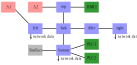

# The Westermo network traffic data set
by Per Erik Strandberg, David Söderman, Alireza Dehlaghi-Ghadim, Miguel Leon Ortiz, Tijana Markovic,
Sasikumar Punnekkat, Mahshid Helali Moghadam, and David Buffoni.

Westermo Network Technologies AB (Västerås, Sweden), RISE Research Institutes of Sweden (Västerås,
Sweden), Mälardalen University (Västerås, Sweden) and Tietoevry (Stockholm, Sweden).

April 2023 (version v 1.0)

## Abstract
There is a growing body of knowledge on network intrusion detection, and several open data sets with
network traffic and cyber-security threats have been released in the past decades. However, many
datasets have aged, were not collected in a contemporary industrial communication system, or do not
easily support research focusing distributed anomaly detection. This repository presents the
Westermo network traffic data set, 1.8 million network packets recorded in over 90 minutes in a
network built up of twelve hardware devices. In addition to the raw data in pcap-format, the data
set also contains pre-processed data in the form of network flows in cvs-files. This data set can
support the research community for topics such as intrusion detection, anomaly detection,
misconfiguration detection, distributed or federated AI, and attack classification. In particular,
we aim to use the data set to continue work on resource constrained distributed AI in edge devices.

**Keywords**: industrial communication system, cyber-physical systems, network intrusion detection,
distributed artificial intelligence.

## Objective
The release of this data set is motivated by several factors:
 * High value to research: realistic industry data is frequently requested by researchers.). As far
   as we can tell, network traffic data sets are not often collected in multiple places in the same
   network topology in the same experiment.
 * Beneficence in general: Releasing the data might do good as new research, algorithms or tools
   could be valuable not only for researchers, but also for the general public, and for Westermo. 
 * Industry-academia relations: One often says that there is a distance between academia and
   industry, release of data could hopefully render researched solutions more realistic and would
   thereby lower thresholds for industry adoption of research artifacts, as well as simplify
   relations between academia and industry.

Overall network topology used during data collection. Pink: A1 and A2 were used for generating
anomalies. Blue: Westermo devices in the controller network. Green: Raspberry Pis running HMI or
PLCs of ICSSIM. Gray: Raspberry Pi running the physical world simulator of ICSSIM.

## Data description

### Raw Data
The raw data consists of two sets of pcap-files of network traffic collected with tcpdump. Each
packet represents a packet going into or out of one of the device doing the recording: left, right,
or bottom, see Figure. Some packets would first go into the device and then out of it, so there are
many duplicated packets in the data.
The physical world and factory simulator of ICSSIM was used in the data collection, and some of this
traffic is not representative of a factory. For this reason, we present two sets of pcap-files:
the reduced set where the physical world simulator is removed, and the extended dataset where it is
kept. See above Tables for an overview of the amount of packets in the pcap-files, as well as an
overview of the communication protocols used.

When network events are triggered, this is described in a log-file with timestamps and other
information needed to make sense of the network traffic. One could say that this description
contains information on labels of the network as a whole (not individual packets). Labels for
individual packets could possibly be inferred. 

#### Reduced:

|         |   left |  bottom | right  |
|---------|--------|---------|--------|
|  ARP    |  12547 |   10230 |  6183  |
|  ICMP   |     26 |       - |     -  |
|  IGMP   |   1650 |    2875 |   438  |
|  LLDP   |    905 |    1086 |   543  |
|  RSTP   |   8163 |   13608 |  5445  |
|  TCP    | 256378 | 1484940 | 21740  |
|  UDP    |   1436 |    1076 |   718  |
|**Total**| 281105 | 1513815 |  35067 |

#### Extended:

|         |   left |  bottom |   right |
|---------|--------|---------|---------|
|  ARP    |  12639 |   11513 |    6234 |
|  ICMP   |     26 |    4636 |       6 |
|  IGMP   |   1650 |    3284 |     438 |
|  LLDP   |    905 |    1086 |     543 |
|  RSTP   |   8163 |   13608 |    5445 |
|  TCP    | 256378 | 4348980 |   21740 |
|  UDP    |   1436 |    1076 |     718 |
|**Total**| 281197 | 4384183 |   35124 |

### Data Cleaning
To protect Westermo, the data set was analyzed prior to release. Some traffic that was unwanted,
or that could possibly reveal details of various Westermo assets, has been removed. In order to
prepare the reduced and extended data sets, traffic going to or from the SimFact node was removed.
In these analysis and filtration steps, Python3 and Scapy was used.

### Network Flows, Processed Data for Machine Learning}

In addition, we have analyzed the network traffic with a tool to extract network flows. The
ICSFlowGenerator tool by Ghadim et al. is implemented in Python with the Scapy library. It iterates
through the raw PCAP data, and creates CSV files with flow features. The CSV files contain 54
columns with 50 features and 4 labels. There are three categories of features: flow features,
general features, and TCP features.

## Network Devices used

Overview of hardware used:

|Name    | Initial IP    | MAC               | Hardware            |
|--------|---------------|-------------------|---------------------|
|A1      | 198.18.134.99 | 00:24:9b:6d:b8:89 | Laptop              |  
|A2      | 198.18.134.14 | b8:27:eb:d1:b7:ef | Raspberry Pi 3B+    |
|hub     | 198.18.134.1  | 00:07:7c:88:6e:83 | Westermo router     |
|left    | 198.18.134.2  | 00:07:7c:88:6e:63 | Westermo router     |
|filler  | 198.18.134.3  | 00:07:7c:29:de:41 | Westermo router     |
|right   | 198.18.134.4  | 00:07:7c:29:de:61 | Westermo router     |
|top     | 198.18.134.5  | 00:07:7c:8c:43:83 | Westermo router     |
|bottom  | 198.18.134.6  | 00:07:7c:8c:43:63 | Westermo router     |
|PLC1    | 198.18.134.11 | b8:27:eb:6d:4f:4b | Raspberry Pi 3 v1.2 |
|PLC2    | 198.18.134.12 | b8:27:eb:5b:50:19 | Raspberry Pi 3B+    |
|HMI1    | 198.18.134.15 | b8:27:eb:15:88:9c | Raspberry Pi 3 v1.2 |
|SimFact | 198.18.134.31 | b8:27:eb:3e:5d:96 | Raspberry Pi 2B     |

The network traffic was collected in a physical network topology constructed to be similar to an
industrial communication network, see above Figure and Table. With ICSSIM this network simulated a
bottle filling factory.

Twelve physical devices were involved: a laptop, six routers, and five Raspberry Pi (RPI) devices,
see details in above Table. The six routers acted as the industrial communication system, and ran
the RSTP redundancy protocol. One of the RPIs acted as Human-machine interfaces (HMI) of the
factory simulator, and two acted as programmable logic controllers (PLC). The fourth RPI ran the
simulator for the physical world (with water tanks, etc.), and the final RPI ran the attack toolkit
from ICSSIM.

To trigger network events, A1 ran scripts implemented with Westermo's test automation framework
(see Strandberg 2021). A2 was used for the man-in-the-middle (MITM). The network events were:

 * Good ssh: the user alice uses ssh to login to one of the devices and checks the contents of a
   log file.
 * Bad ssh: A1 generates a number of unsuccessful ssh login attempts to a randomly selected router
   using randomly selected usernames and passwords from a set of credentials based on Mirai botnet.
 * Misconf ip: A user sets an invalid IP on a router, e.g.\ setting it to 198.134.18.37 instead of
   198.18.134.37 (note the swapped second and third octet). After some time, a reasonable address is
   configured. This was configured over a serial console to the router (i.e., the configuration
   cannot be discovered in the network data, only the effect of the configuration).
 * Misconf same IP: A user sets the same IP on two devices. After some time, a different address is
   set. Again, this was configured from the console.
 * Port scan: A1 runs nmap to scan the ports of one or more device in the network.
 * MITM attack: A2 runs a MITM attack, steals network traffic in a link, and rewrites certain
   packets.

The events were conducted in batches, one after the other, and repeated 16 times for a total of 96
events. Between each event there was between 12 and 28 seconds of time for recovery and for the
network to be idle. Each batch had the order of the events randomized. The total duration of the
data recording was about 5440 seconds, or a little over 90 minutes.

## Ethics statements
To protect Westermo and individuals that contributed to the data, information security risk
workshops have been conducted at Westermo.

## Acknowledgments
This work has been funded by Westermo Network Technologies AB, and the InSecTT project through ECSEL
Joint Undertaking (JU) under grant agreement No. 876038.

Some authors of this paper are employed at Westermo Network Technologies AB.

## License
This data set is licensed with the [Creative Commons Attribution 4.0
International](https://creativecommons.org/licenses/by/4.0/).

In short, you are free to: share, copy and redistribute the material;
and to adapt, remix, transform, and build upon it for any purpose;
under the condition that you you give appropriate credit, and do not
restrict others from doing anything the license permits. Read the
license for details.

Suggested attribution: P. E. Strandberg, D. Söderman, A. Dehlaghi-Ghadim, M. Leon Ortiz, 
T. Markovic, S. Punnekkat, M. Helali Moghadam, and D. Buffoni. (2023). The Westermo network
traffic data set. Retrieved from <https://github.com/westermo>

## References
 1. A. D. Ghadim, A. Balador, M. H. Moghadam, H. Hansson, and M. Conti. ICSSIM -- a framework
    for building industrial control systems security testbeds. Computers in Industry, 148:103906,
	2023.
 1. A. D. Ghadim, A. Balador, M. Helali Moghadam, and H. Hansson. Anomaly detection dataset for
    industrial control systems. (in press), 2023.
 1. T. Markovic, M. Leon, D. Buffoni, and S. Punnekkat. Random forest based on federated learning
    for intrusion detection. In Artificial Intelligence Applications and Innovations: 18th IFIP WG
	12.5 International Conference, AIAI 2022, Hersonissos, Crete, Greece, June 17–20, 2022,
	Proceedings, Part I, pages 132–144. Springer, 2022.
 1. P. E. Strandberg. Automated System-Level Software Testing of Industrial Networked Embedded
    Systems. PhD thesis, Mälardalen University, 2021.
